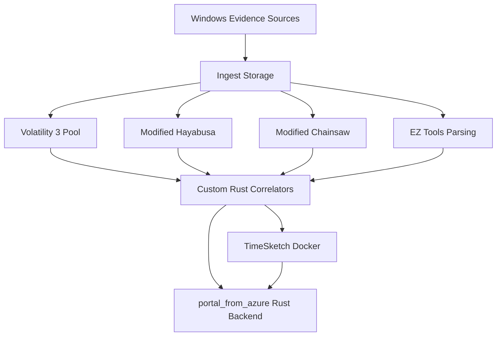
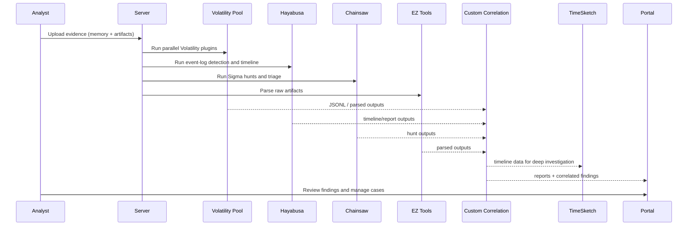
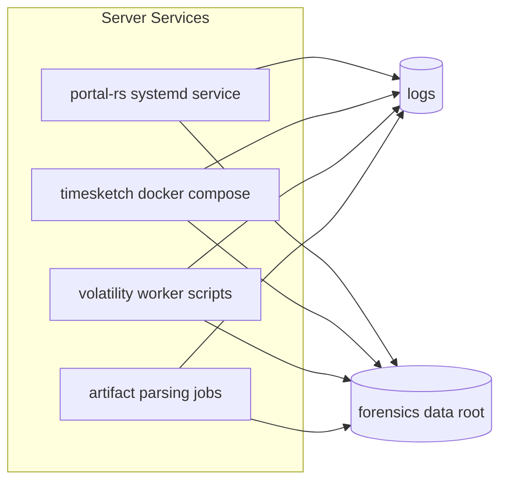

# Linux Server Setup and Configuration Guide

This guide documents a production-style setup for this forensic platform on a Linux server, using:

- Docker for TimeSketch
- Multiple Volatility 3 instances for parallel memory analysis
- Modified Hayabusa and Chainsaw
- EZ tools (.NET) for raw artifact parsing
- Custom Rust/Python tools from this repository
- Updated portal from `portal_from_azure`

The instructions are written for Ubuntu 22.04/24.04 LTS (recommended), but most steps also work on Arch/Debian with small package-manager changes.

---

## 1. Target Architecture







---

## 2. Recommended Server Baseline

## 2.1 Hardware

- CPU: 16+ vCPU recommended (Volatility and Rust analytics benefit heavily)
- RAM: 64 GB minimum, 128 GB preferred for parallel memory analysis
- Storage: NVMe SSD, at least 2 TB for active cases
- Optional separate disk for long-term case archive

## 2.2 Create dedicated user and directories

```bash
sudo useradd -m -s /bin/bash forensic
sudo usermod -aG sudo forensic
sudo mkdir -p /srv/forensics/{cases,tools,logs,tmp,backups}
sudo chown -R forensic:forensic /srv/forensics
```

Use this as your working root:

```bash
export FORENSICS_ROOT=/srv/forensics
```

## 2.3 Base packages

```bash
sudo apt update
sudo apt install -y \
  git curl wget unzip zip jq yq tree \
  build-essential pkg-config libssl-dev clang cmake \
  python3 python3-pip python3-venv \
  dotnet-sdk-8.0 \
  redis-tools sqlite3
```

Notes:

- .NET 8 SDK is used to run EZ .dll tools with `dotnet <tool>.dll`.
- If your EZ bundle requires .NET 9 specifically, install `dotnet-sdk-9.0` as well.

## 2.4 Rust toolchain

```bash
curl --proto '=https' --tlsv1.2 -sSf https://sh.rustup.rs | sh
source ~/.cargo/env
rustup default stable
rustup component add rustfmt clippy
```

---

## 3. Clone and Prepare the Workspace

```bash
cd /srv/forensics/tools
git clone <your-repo-url> wsl
cd wsl
```

Set permissions for scripts:

```bash
chmod +x memory_corelation/generate_vol3_jsonl.sh
chmod +x portal_from_azure/scripts/start_rust_portal.sh
chmod +x portal_from_azure/scripts/start_timeline_arch.sh
```

---

## 4. Docker Setup (TimeSketch)

Your repository already includes Docker install notes in `docker_install.md`. Equivalent install sequence:

```bash
sudo install -m 0755 -d /etc/apt/keyrings
curl -fsSL https://download.docker.com/linux/ubuntu/gpg | \
  sudo gpg --dearmor -o /etc/apt/keyrings/docker.gpg
sudo chmod a+r /etc/apt/keyrings/docker.gpg

echo "deb [arch=$(dpkg --print-architecture) signed-by=/etc/apt/keyrings/docker.gpg] \
https://download.docker.com/linux/ubuntu $(lsb_release -cs) stable" | \
sudo tee /etc/apt/sources.list.d/docker.list > /dev/null

sudo apt update
sudo apt install -y docker-ce docker-ce-cli containerd.io docker-buildx-plugin docker-compose-plugin
sudo usermod -aG docker forensic
```

Re-login to apply Docker group changes.

## 4.1 TimeSketch deployment (recommended pattern)

Create a dedicated compose project:

```bash
mkdir -p /srv/forensics/timesketch
cd /srv/forensics/timesketch
```

Create `docker-compose.yml`:

```yaml
services:
  opensearch:
    image: opensearchproject/opensearch:2.13.0
    environment:
      - discovery.type=single-node
      - plugins.security.disabled=true
      - OPENSEARCH_JAVA_OPTS=-Xms2g -Xmx2g
    ulimits:
      memlock:
        soft: -1
        hard: -1
    volumes:
      - opensearch-data:/usr/share/opensearch/data
    ports:
      - "9200:9200"

  postgres:
    image: postgres:15
    environment:
      - POSTGRES_DB=timesketch
      - POSTGRES_USER=timesketch
      - POSTGRES_PASSWORD=change-this-db-password
    volumes:
      - postgres-data:/var/lib/postgresql/data

  redis:
    image: redis:7

  timesketch:
    image: us-docker.pkg.dev/osdfir-registry/timesketch/timesketch:latest
    depends_on:
      - opensearch
      - postgres
      - redis
    environment:
      - POSTGRES_HOST=postgres
      - POSTGRES_DB=timesketch
      - POSTGRES_USER=timesketch
      - POSTGRES_PASSWORD=change-this-db-password
      - OPENSEARCH_HOST=opensearch
      - REDIS_HOST=redis
    ports:
      - "5000:5000"
    volumes:
      - ./data:/usr/share/timesketch/data

volumes:
  opensearch-data:
  postgres-data:
```

Start:

```bash
docker compose up -d
docker compose ps
```

If you already have an official TimeSketch deployment procedure, keep that and only use this compose as a reference baseline.

---

## 5. Volatility 3 Multi-Instance Strategy

## 5.1 Install Volatility 3

```bash
python3 -m venv /srv/forensics/venvs/vol3
source /srv/forensics/venvs/vol3/bin/activate
pip install --upgrade pip
pip install volatility3
```

Add executable path (optional):

```bash
echo 'export PATH=/srv/forensics/venvs/vol3/bin:$PATH' >> ~/.bashrc
source ~/.bashrc
```

## 5.2 Configure symbols

The script `memory_corelation/generate_vol3_jsonl.sh` defaults to:

- `vol --symbol-dirs ~/volatility3/symbols`

Create this path or modify the script for your symbol location.

```bash
mkdir -p ~/volatility3/symbols
```

## 5.3 Run multiple instances in parallel

Use case-level folders:

```bash
mkdir -p /srv/forensics/cases/CASE_001/{memory,jsonl,logs,outputs}
```

Parallel pattern example:

```bash
cd /srv/forensics/tools/wsl/memory_corelation

./generate_vol3_jsonl.sh -m /srv/forensics/cases/CASE_001/memory/mem.raw -o /srv/forensics/cases/CASE_001/jsonl
```

For heavy workloads, split plugin sets into separate scripts and run in parallel using `xargs -P` or a scheduler.

## 5.4 Correlation output

`generate_vol3_jsonl.sh` auto-invokes:

```bash
./target/release/vol3-correlate --input <jsonl_dir> --output html --memory-hash <sha256>
```

Build once first:

```bash
cd /srv/forensics/tools/wsl/memory_corelation
cargo build --release
```

---

## 6. Modified Hayabusa Setup

Your modified Hayabusa source appears at:

- `portal_from_azure/tools/win_event_analysis`

Build:

```bash
cd /srv/forensics/tools/wsl/portal_from_azure/tools/win_event_analysis
cargo build --release
```

Primary binary name is `hayabusa`.

Example runs:

```bash
./target/release/hayabusa csv-timeline -d /path/to/evtx -o timeline.csv -p timesketch-verbose
./target/release/hayabusa forensic-report -d /path/to/evtx -o forensic_report.html
```

Notes:

- Keep custom rules under the tool's `rules/` structure.
- Use `update-rules` only if you want to sync with upstream and then re-validate your modifications.

---

## 7. Modified Chainsaw Setup

Workspace includes a bundled binary at:

- `chainsaw/chainsaw`

Make executable and verify:

```bash
cd /srv/forensics/tools/wsl/chainsaw
chmod +x chainsaw
./chainsaw --help
```

Example hunt against EVTX with local Sigma bundle:

```bash
./chainsaw hunt /cases/CASE_001/evtx \
  -s ./sigma \
  --mapping ./mappings/sigma-event-logs-all.yml \
  --json \
  -o ./results/case001_chainsaw.json
```

If your Chainsaw is modified, preserve your custom mapping and rules files in version control.

---

## 8. EZ Tools on Linux (Raw Artifact Parsing)

Folder:

- `ez_tools_net9`

Most tools can be run on Linux using `.dll` via `dotnet`.

Examples:

```bash
cd /srv/forensics/tools/wsl/ez_tools_net9

# MFT parsing
dotnet MFTECmd.dll -f /path/to/$MFT --csv /srv/forensics/cases/CASE_001/outputs/mftecmd

# Registry Explorer command-line parser
dotnet RECmd/RECmd.dll --help

# Jump list parser
dotnet JLECmd.dll --help
```

If any tool fails with runtime mismatch, install the corresponding runtime (`dotnet --list-runtimes`) and retry.

---

## 9. Build Your Custom Tools (Rust Projects)

Rust projects in this workspace include:

- `browser_forensics`
- `data_theft`
- `memory_corelation` (vol3-correlate)
- `network_forensics`
- `ntfs_analyzer`
- `prefetch_analyzer`
- `prefetch_viewer`
- `registry_analyzer`
- `registry_viewer`
- `shim-amcache_analyzer`
- `srum_analysis`
- `portal_from_azure/rust-backend`

One-shot build loop:

```bash
cd /srv/forensics/tools/wsl

for d in browser_forensics data_theft memory_corelation network_forensics ntfs_analyzer \
         prefetch_analyzer prefetch_viewer registry_analyzer registry_viewer \
         shim-amcache_analyzer srum_analysis portal_from_azure/rust-backend; do
  echo "[+] Building $d"
  (cd "$d" && cargo build --release)
done
```

---

## 10. Deploy Updated Portal (portal_from_azure)

## 10.1 Configure environment

From `portal_from_azure/.env.example`:

```bash
cd /srv/forensics/tools/wsl/portal_from_azure
cp .env.example .env
```

Update minimum values:

- `SECRET_KEY` (generate with `openssl rand -hex 32`)
- `BIND=0.0.0.0:8000`
- `DATABASE_URL=portal.db`
- `RUST_LOG=info`
- Optional: `REPORT_PATHS_FILE=/srv/forensics/tools/wsl/portal_from_azure/report_paths.toml`

## 10.2 Configure report paths

Edit:

- `portal_from_azure/report_paths.toml`

Set each report path to your Linux server absolute paths.

## 10.3 Build and run

```bash
cd /srv/forensics/tools/wsl/portal_from_azure
./scripts/start_rust_portal.sh build
./scripts/start_rust_portal.sh start
./scripts/start_rust_portal.sh status
```

Default bind is `0.0.0.0:8000`.

## 10.4 Portal start command runbook

Use these commands during daily operations:

```bash
cd /srv/forensics/tools/wsl/portal_from_azure

# Start portal in background (production mode)
./scripts/start_rust_portal.sh start

# Check if portal is running
./scripts/start_rust_portal.sh status

# Restart after config or binary updates
./scripts/start_rust_portal.sh restart

# Stop portal
./scripts/start_rust_portal.sh stop

# Build only (no start)
./scripts/start_rust_portal.sh build

# Developer mode (foreground, debug build)
./scripts/start_rust_portal.sh dev
```

Fast verification commands:

```bash
# Health endpoint
curl -s http://127.0.0.1:8000/health | jq

# Confirm listener
ss -ltnp | grep ':8000'

# Check latest log output
tail -n 100 /srv/forensics/tools/wsl/portal_from_azure/logs/portal-$(date +%Y%m%d).log
```

If using systemd service:

```bash
sudo systemctl start forensics-portal
sudo systemctl restart forensics-portal
sudo systemctl stop forensics-portal
sudo systemctl status forensics-portal
journalctl -u forensics-portal -n 200 --no-pager
```

## 10.5 Portal modules and what they contain

The Rust backend mounts these route modules:

- `auth_routes`: login page, token issue, logout
  - URLs: `/auth/login`, `/auth/token`, `/auth/logout`
- `dashboard`: primary analyst dashboard and module tiles
  - URL: `/dashboard`
- `resources`: resource catalog APIs
  - URLs: `/api/resources`, `/api/resources/categories/list`, `/api/resources/{resource_id}`
- `reports`: HTML report serving through report path mapping
  - URL: `/reports/{report_id}`
- `reporting`: in-portal report authoring/export features
  - URLs: `/tools/reporting`, `/tools/reporting/save`, `/tools/reporting/export`, `/tools/reporting/{report_id}`
- `files`: file browser API
  - URLs: `/api/files`, `/api/files/content`, `/api/files/info`
- `fetched_files`: fetched file explorer plus PE entropy execution/report APIs
  - URLs: `/fetched-files`, `/api/fetched-files/list`, `/api/fetched-files/download`, `/api/fetched-files/download-zip`, `/api/fetched-files/run-pe-entropy`, `/api/fetched-files/pe-entropy-report`
- `iocs`: IOC browser and IP reputation lookup from ipsum feed
  - URLs: `/tools/iocs`, `/api/iocs/stats`, `/api/iocs/lookup`, `/api/iocs/list`, `/api/iocs/refresh`
- `terminal`: admin-only WebSocket terminal module
  - URLs: `/tools/terminal`, `/tools/terminal/ws`
- `timesketch`: reverse proxy module exposing local TimeSketch through portal auth
  - URLs: `/tools/timesketch`, `/tools/timesketch/`, `/tools/timesketch/{*path}`
- `admin`: user/admin management module
  - URLs: `/admin/panel`, `/admin/users`, `/admin/users/{username}`, `/admin/users/{username}/make-admin`, `/admin/users/{username}/revoke-admin`

Additional built-in platform endpoints:

- Root redirect: `/` -> `/dashboard`
- Health: `/health`
- Static assets: `/static/{*file}`
- Embedded Timeline Explorer: `/tools/timeline/`, `/tools/timeline/{*file}`

Dashboard-visible analyst modules include:

- Timeline Explorer
- Registry
- NTFS Data
- Memory Analysis
- Windows Event
- Shimcache Amcache Report
- Prefetch Report
- TimeSketch
- IOC Scan
- IOC/Hash Scan
- Network Forensics
- Data Theft
- Browser Forensics
- Fetched Files
- PE Entropy
- IOCs
- Server Terminal
- Reports
- Settings

## 10.6 Suggested startup order (portal + timesketch)

```bash
# 1) Start TimeSketch first
cd /srv/forensics/timesketch
docker compose up -d

# 2) Start portal backend
cd /srv/forensics/tools/wsl/portal_from_azure
./scripts/start_rust_portal.sh start

# 3) Validate both
curl -s http://127.0.0.1:8000/health | jq
docker compose ps
```

Why this order matters:

- The portal `timesketch` module proxies requests to local TimeSketch upstream.
- Starting TimeSketch first avoids initial 502 errors in `/tools/timesketch/`.

## 10.7 Admin bootstrap

From `portal_from_azure/ADMIN_GUIDE.md` default admin is:

- Username: `admin`
- Password: `admin123`

Change this immediately after first login.

---

## 11. systemd Services

## 11.1 portal-rs service

Create `/etc/systemd/system/forensics-portal.service`:

```ini
[Unit]
Description=Forensics Portal (Rust)
After=network.target

[Service]
Type=forking
User=forensic
WorkingDirectory=/srv/forensics/tools/wsl/portal_from_azure
ExecStart=/srv/forensics/tools/wsl/portal_from_azure/scripts/start_rust_portal.sh start
ExecStop=/srv/forensics/tools/wsl/portal_from_azure/scripts/start_rust_portal.sh stop
ExecReload=/srv/forensics/tools/wsl/portal_from_azure/scripts/start_rust_portal.sh restart
Restart=on-failure
RestartSec=3

[Install]
WantedBy=multi-user.target
```

Enable:

```bash
sudo systemctl daemon-reload
sudo systemctl enable --now forensics-portal
sudo systemctl status forensics-portal
```

## 11.2 TimeSketch compose service

Create `/etc/systemd/system/timesketch-compose.service`:

```ini
[Unit]
Description=TimeSketch Docker Compose
After=docker.service
Requires=docker.service

[Service]
Type=oneshot
RemainAfterExit=yes
WorkingDirectory=/srv/forensics/timesketch
ExecStart=/usr/bin/docker compose up -d
ExecStop=/usr/bin/docker compose down

[Install]
WantedBy=multi-user.target
```

Enable:

```bash
sudo systemctl daemon-reload
sudo systemctl enable --now timesketch-compose
sudo systemctl status timesketch-compose
```

---

## 12. Suggested Case Directory Convention

```text
/srv/forensics/cases/
  CASE_YYYYMMDD_HOST/
    evidence/
      memory/
      evtx/
      kape/
      raw/
    outputs/
      volatility3/
      hayabusa/
      chainsaw/
      ez_tools/
      custom_tools/
      correlation/
      reports/
    logs/
```

Keep all tool outputs per-case and immutable after report sign-off.

---

## 13. Security and Hardening Checklist

- Use a reverse proxy (Nginx/Caddy) with TLS in front of portal and TimeSketch
- Restrict inbound ports: 22, 443, and only required internal ports
- Rotate logs (`logrotate` for portal logs, Docker log limits)
- Backup:
  - `portal_from_azure/portal.db`
  - `/srv/forensics/cases`
  - TimeSketch PostgreSQL and OpenSearch volumes
- Remove default credentials and enforce strong admin password policy
- Use a dedicated non-root service user (`forensic`)

---

## 14. Validation Runbook

After setup, validate end-to-end:

1. Build all Rust tools (`cargo build --release`) succeeds.
2. `./chainsaw --help` works.
3. `./target/release/hayabusa --help` works.
4. `dotnet MFTECmd.dll --help` works from `ez_tools_net9`.
5. Volatility command works (`vol -h` or your configured command).
6. Portal status is running: `./scripts/start_rust_portal.sh status`.
7. TimeSketch containers are healthy: `docker compose ps`.
8. Create test case folder and run one sample evidence pipeline.

---

## 15. Operations: Updates and Rollback

## Update routine

```bash
cd /srv/forensics/tools/wsl
git pull

# Rebuild changed Rust components
cd portal_from_azure/rust-backend && cargo build --release
cd ../.. && cd memory_corelation && cargo build --release
cd ../portal_from_azure/tools/win_event_analysis && cargo build --release
```

Restart services:

```bash
sudo systemctl restart forensics-portal
sudo systemctl restart timesketch-compose
```

## Rollback strategy

- Keep previous Git tag/commit and previous release binaries
- Snapshot `portal.db` and case outputs before major upgrades
- For Docker images, pin known-good tags in compose

---

## 16. Notes Specific to This Repository

- The updated portal to deploy is `portal_from_azure`.
- Portal runtime config is primarily `.env` plus `report_paths.toml`.
- Memory correlation helper script is `memory_corelation/generate_vol3_jsonl.sh`.
- Hayabusa implementation in this repo is `portal_from_azure/tools/win_event_analysis`.
- Chainsaw binary and local Sigma/mappings are under `chainsaw/`.

This setup gives you reproducible, service-based operations for continuous forensic workflows on Linux.
