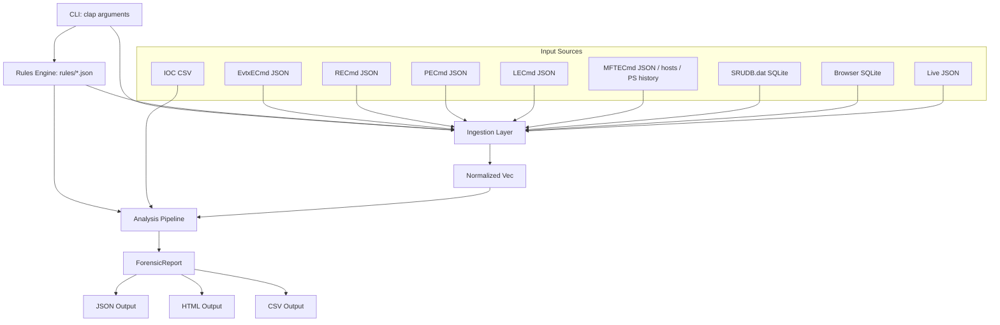
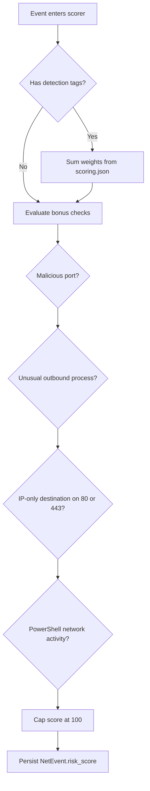
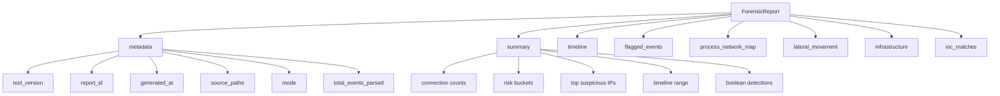
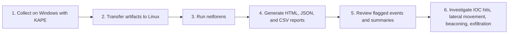

# NetForens — Windows Network Forensics Analysis Tool

## Table of Contents

1. [Overview](#overview)
2. [Architecture](#architecture)
3. [Installation & Building](#installation--building)
4. [CLI Usage](#cli-usage)
5. [Input Sources & Parsers](#input-sources--parsers)
6. [Data Model](#data-model)
7. [Rules Engine](#rules-engine)
8. [Analysis Pipeline](#analysis-pipeline)
9. [Scoring System](#scoring-system)
10. [Output Formats](#output-formats)
11. [Analyst Triage Guide](#analyst-triage-guide)
12. [Report Structure](#report-structure)
13. [Workflow Example](#workflow-example)
14. [Project Structure](#project-structure)

---

## Overview

**NetForens** (`netforens`) is a command-line forensic analysis tool written in Rust. It ingests Windows forensic artifacts that have been pre-parsed by [KAPE](https://www.kroll.com/en/services/cyber-risk/incident-response-litigation-support/kroll-artifact-parser-extractor-kape) and its associated modules (EvtxECmd, RECmd, LECmd, PECmd, MFTECmd) plus SQLite databases (SRUDB.dat, browser history) and produces structured JSON/CSV reports detailing network-relevant activity from the target system.

The tool is designed to be **executed on a Linux machine** against artifacts collected from a Windows endpoint. It does **not** perform live network capture or require access to the original Windows host.

### Key Capabilities

- Parse 9 distinct artifact types from KAPE output, SQLite databases, and plain text files
- Normalize all artifacts into a unified event model (`NetEvent`)
- Detect lateral movement, C2 beaconing, data exfiltration, persistence mechanisms, and DGA domains
- Cross-reference events against an IOC feed (CSV)
- Score every event on a 0–100 risk scale using configurable, external rule files
- Export results as JSON and/or CSV with severity-based filtering

### Design Principles

- **No hardcoded detection logic**: All indicator lists, scoring weights, and detection thresholds live in JSON rule files under `rules/`. Analysts can tune them without recompiling.
- **Graceful degradation**: Missing input sources or rule files are handled with warnings, not fatal errors. The tool runs with whatever data is available.
- **Modular pipeline**: Ingestion, analysis, and output are cleanly separated. Each ingestion parser and analysis module operates independently.

---

## Architecture


___

```
┌─────────────────────────────────────────────────────────────────────┐
│                          CLI (clap)                                 │
│   --kape-path  --evtx-path  --live-json  --ioc-feed  --rules-dir    │
│   --mode  --out-format  --out-dir  --severity                       │
└───────────────────────────────┬─────────────────────────────────────┘
                                │
                    ┌───────────▼───────────┐
                    │    Rules Engine       │
                    │   (rules/*.json)      │
                    │   → RuleSet struct    │
                    └───────────┬───────────┘
                                │
         ┌──────────────────────▼──────────────────────┐
         │              Ingestion Layer                │
         │  ┌─────────┬──────────┬──────────┬────────┐ │
         │  │EvtxECmd │ RECmd    │ PECmd    │  SRUM  │ │
         │  │  JSON   │  JSON    │  JSON    │ SQLite │ │
         │  ├─────────┼──────────┼──────────┼────────┤ │
         │  │ LECmd   │ MFTECmd  │ Browser  │  Live  │ │
         │  │  JSON   │  JSON    │ SQLite   │  JSON  │ │
         │  ├─────────┴──────────┴──────────┼────────┤ │
         │  │ hosts (text) │ PS History (text)│  IOC │ │
         │  │              │                  │  CSV │ │
         │  └──────────────┴──────────────────┴──────┘ │
         │         All output → Vec<NetEvent>          │
         └──────────────────────┬──────────────────────┘
                                │
         ┌──────────────────────▼──────────────────────┐
         │             Analysis Pipeline               │
         │                                             │
         │  1. IOC Tagging                             │
         │  2. Timeline Builder (sort + dedup)         │
         │  3. Process → Network Attribution           │
         │  4. Lateral Movement Detector               │
         │  5. C2 / Beaconing Heuristics               │
         │  6. Exfiltration Indicators                 │
         │  7. Network Infrastructure Profiler         │
         │  8. Anomaly Scorer                          │
         │                                             │
         │         Output → ForensicReport             │
         └──────────────────────┬──────────────────────┘
                                │
                    ┌───────────▼───────────┐
                    │    Output Layer        │
                    │  JSON / HTML / CSV     │
                    └───────────────────────┘
```

---

## Installation & Building

### Prerequisites

- **Rust** (edition 2024 / stable toolchain)
- **Linux** host (the tool is built and executed on Linux; it analyzes Windows artifacts)

### Build

```bash
cd /path/to/Network
cargo build --release
```

The compiled binary is at `target/release/netforens`.

### Dependencies

| Crate       | Purpose                                     |
|-------------|---------------------------------------------|
| `clap` 4    | CLI argument parsing (derive macros)        |
| `serde` 1   | Serialization / deserialization framework   |
| `serde_json` 1 | JSON parsing and generation              |
| `chrono` 0.4 | DateTime handling with timezone support    |
| `rusqlite` 0.31 | SQLite access (bundled, no system lib)  |
| `csv` 1     | CSV reading (IOC feed) and writing (output) |
| `regex` 1   | Regular expression support                  |
| `anyhow` 1  | Ergonomic error handling                    |
| `thiserror` 1 | Structured error types                    |
| `log` 0.4   | Logging facade                              |
| `env_logger` 0.11 | Console logger implementation         |
| `uuid` 1    | Report ID generation (v4)                   |
| `glob` 0.3  | File pattern matching for discovery         |

---

## CLI Usage

```
netforens [OPTIONS]
```

### Options

| Flag                     | Type     | Default  | Description                                               |
|--------------------------|----------|----------|-----------------------------------------------------------|
| `--kape-path <DIR>`      | Path     | —        | Root directory of KAPE output (contains parsed artifacts)  |
| `--evtx-path <DIR>`      | Path     | —        | Separate directory of EvtxECmd JSON output                 |
| `--live-json <FILE>`     | Path     | —        | JSON file from live network capture (tshark, Zeek, etc.)   |
| `--ioc-feed <CSV>`       | Path     | —        | CSV file with Indicators of Compromise                     |
| `--rules-dir <DIR>`      | Path     | `rules`  | Directory containing JSON rule files                       |
| `--mode <MODE>`          | Enum     | `full`   | Analysis mode (see below)                                  |
| `--out-format <FORMAT>`  | Enum     | `json`   | Output format (see below)                                  |
| `--out-dir <DIR>`        | Path     | `output` | Directory where reports are written                        |
| `--severity <LEVEL>`     | Enum     | `low`    | Minimum severity filter for output                         |

### Modes

| Mode          | Behavior                                                                 |
|---------------|--------------------------------------------------------------------------|
| `full`        | Process all sources (KAPE + EVTX + live + filesystem). All modules run. |
| `fast`        | Skip heavy parsers ($MFT, USN Journal, Amcache). Faster execution.      |
| `live-only`   | Only process `--live-json` input. Skip all KAPE/EVTX sources.          |
| `past-only`   | Only process KAPE + EVTX artifacts. Skip live capture input.           |

### Output Formats

| Format | Files Generated                                |
|--------|------------------------------------------------|
| `json` | `forensic_report.json`                         |
| `html` | `forensic_report.html`                         |
| `csv`  | `forensic_events.csv` (filtered by severity)   |
| `all`  | JSON, HTML, and CSV                            |

### Severity Levels

| Level    | Minimum Risk Score | Effect                           |
|----------|--------------------|----------------------------------|
| `low`    | 0                  | Include all events               |
| `medium` | 34                 | Exclude low-score noise          |
| `high`   | 67                 | Only critical findings           |

### Examples

```bash
# Full analysis of a KAPE output directory
netforens --kape-path /cases/case001/kape_output --out-format all --out-dir ./report

# Fast mode with IOC cross-reference
netforens --kape-path /cases/case001/kape_output \
          --ioc-feed /intel/iocs.csv \
          --mode fast \
          --severity medium

# Analyze only EVTX logs
netforens --evtx-path /cases/case001/evtx_json --out-format json

# Generate the interactive HTML dashboard report
netforens --kape-path /cases/case001/kape_output --out-format html

# Live capture analysis only
netforens --live-json /captures/conn_log.json --mode live-only

# Custom rules directory
netforens --kape-path /cases/case001/kape_output --rules-dir /custom/rules
```

### Logging

Set the `RUST_LOG` environment variable to control verbosity:

```bash
RUST_LOG=debug netforens --kape-path ./kape_output    # Verbose
RUST_LOG=warn  netforens --kape-path ./kape_output     # Errors/warnings only
```

---

## Input Sources & Parsers

NetForens includes 9 ingestion parsers. Each implements the `ArtifactParser` trait and produces `Vec<NetEvent>`.

### 1. EVTX Event Log Parser (`evtx.rs`)

| Property         | Value                                                |
|------------------|------------------------------------------------------|
| **Input format** | JSON-Lines or JSON array                             |
| **KAPE module**  | EvtxECmd                                             |
| **File discovery**| `**/*.json` under the provided path                 |

**Event IDs parsed:**

| Event ID(s)    | Channel / Source          | What It Captures                                           |
|----------------|---------------------------|------------------------------------------------------------|
| 5156 / 5157    | Security (WFP)            | Connection allowed / blocked — src/dst IP, port, process   |
| 5158           | Security (WFP)            | Port bind — local address, port, process                   |
| 4624 / 4625    | Security                  | Logon success / failure (Type 3 network, Type 10 RDP)      |
| 4648           | Security                  | Explicit credential use (runas / net use)                  |
| 4768 / 4769    | Security                  | Kerberos TGT / TGS request — source IP, username           |
| 4776           | Security                  | NTLM authentication — workstation, username                |
| 7045           | System                    | New service installed — image path, service name            |
| 1149           | RemoteConnectionManager   | RDP connection — source IP, username                        |
| 21 / 22 / 24 / 25 | LocalSessionManager    | RDP session events — address, user                         |
| 59 / 60        | BITS Client               | BITS job start/stop — URL                                  |
| 3006 / 3008    | DNS Client                | DNS query success / NXDOMAIN — query name                  |
| 2004 / 2006    | Firewall                  | Firewall rule added / deleted — application path            |
| 4103 / 4104    | PowerShell                | Script block execution — filters for network keywords       |
| 106 / 200      | Task Scheduler            | Task registered / executed — task name, action              |

Fields are extracted from EvtxECmd's flattened JSON using a `payload_field()` helper that searches top-level keys and `PayloadData1`–`PayloadData6` fields.

### 2. SRUM Database Parser (`srum.rs`)

| Property         | Value                                                |
|------------------|------------------------------------------------------|
| **Input format** | SQLite (SRUDB.dat, .sqlite, .db)                     |
| **KAPE module**  | Raw SRUDB.dat collection (opened directly)           |

Reads two tables from the SRUM database:
- **Network usage** (`{D10CA2FE-...}`): AppId, BytesSent, BytesRecvd, Timestamp (FILETIME)
- **Network connectivity** (`{DD6636C4-...}`): AppId, ConnectedTime, Timestamp

Handles Windows FILETIME → UTC conversion.

### 3. Browser History Parser (`browser.rs`)

| Property         | Value                                                |
|------------------|------------------------------------------------------|
| **Input format** | SQLite                                               |
| **Databases**    | Chromium `History` + Firefox `places.sqlite`         |

- **Chromium**: `urls` table (URL, title, visit count, last visit time) + `downloads` table (URL, target path, bytes)
- **Firefox**: `moz_places` + `moz_historyvisits` (URL, title, visit date)

Handles Chromium timestamp epoch (microseconds since 1601-01-01).

### 4. Prefetch Parser (`prefetch.rs`)

| Property         | Value                                                |
|------------------|------------------------------------------------------|
| **Input format** | JSON array or single JSON object                     |
| **KAPE module**  | PECmd                                                |

Extracts: ExecutableName, RunCount, LastRun, SourceFile. Cross-references executable names against `rules/suspicious_tools.json` to tag network reconnaissance and exploitation tools.

### 5. Registry Parser (`registry.rs`)

| Property         | Value                                                |
|------------------|------------------------------------------------------|
| **Input format** | JSON-Lines or JSON array                             |
| **KAPE module**  | RECmd                                                |

Classifies registry entries by key path:

| Key Pattern                         | Artifact                        | Tags Applied                |
|-------------------------------------|---------------------------------|-----------------------------|
| `TypedURLs`                         | Typed URLs in IE/Edge           | —                           |
| `Terminal Server Client\Servers`    | RDP connection history (MRU)    | `RdpAccess`                 |
| `NetworkList\Profiles`              | WiFi/Ethernet profile metadata  | —                           |
| `Network` + `RemotePath`           | Mapped network drives           | `LateralMovement`           |
| `\Run`, `\RunOnce`                 | Persistence with network refs   | `PersistenceMechanism`      |
| `FirewallPolicy`                    | Firewall registry config        | `PersistenceMechanism`      |
| `\BITS`                            | BITS jobs in registry           | `BitsAbuse`, `C2Indicator`  |
| `WinSock2`                          | WinSock LSP tampering           | —                           |
| `TCPIP\Parameters` + `NameServer`  | DNS server configuration        | —                           |

### 6. LNK / JumpList Parser (`lnk.rs`)

| Property         | Value                                                |
|------------------|------------------------------------------------------|
| **Input format** | JSON-Lines or JSON array                             |
| **KAPE module**  | LECmd                                                |

Extracts UNC network paths (`\\server\share`) and URLs from shortcut TargetPath, NetworkPath, and Arguments fields.

### 7. Filesystem Parser (`filesystem.rs`)

| Property         | Value                                                |
|------------------|------------------------------------------------------|
| **Input format** | JSON (MFT/USN/Amcache/Tasks) + plain text            |
| **KAPE module**  | MFTECmd, AmcacheParser, raw file collection           |

Handles five sub-artifact types:
- **$MFT / USN Journal**: Flags network tool file drops and staging directories (`temp`, `staging`, `download`)
- **Amcache**: Execution evidence for suspicious tools (includes SHA1 hashes)
- **Scheduled Tasks**: Tasks with `http`, `ftp`, or UNC paths in commands
- **hosts file**: Non-standard DNS overrides (skips `localhost` entries)
- **PowerShell ConsoleHost_history.txt**: Lines matching `rules/network_keywords.json`

### 8. Live Capture Parser (`live_json.rs`)

| Property         | Value                                                |
|------------------|------------------------------------------------------|
| **Input format** | JSON-Lines or JSON array                             |
| **Source**       | tshark, Zeek, custom capture scripts                 |

Expects records with any of: `src_ip`/`SourceAddress`/`src`, `dst_ip`/`DestAddress`/`dst`, `src_port`/`SourcePort`, `dst_port`/`DestPort`, `protocol`/`proto`, `process_name`/`ProcessName`, `bytes_sent`/`BytesSent`, `bytes_recv`/`BytesRecv`, `timestamp`/`ts`/`Timestamp`. Only keeps records with at least one IP address.

### 9. IOC Feed Parser (`ioc.rs`)

| Property         | Value                                                |
|------------------|------------------------------------------------------|
| **Input format** | CSV with headers                                     |
| **Required column** | `indicator` or `ioc`                              |
| **Optional column** | `type` or `indicator_type`                        |

Auto-detects indicator types if the `type` column is absent:
- Valid IP → `ip`
- Starts with `http://` / `https://` → `url`
- Length 32/40/64 (hex chars) → `hash`
- Everything else → `domain`

The IOC parser does **not** produce events. Instead, it tags existing events that match loaded indicators with `Tag::IocMatch(indicator_string)`.

---

## Data Model

### NetEvent (core normalized event)

Every artifact parser produces `Vec<NetEvent>`. This is the universal event struct that flows through the entire pipeline:

| Field           | Type                      | Description                                      |
|-----------------|---------------------------|--------------------------------------------------|
| `timestamp`     | `Option<DateTime<Utc>>`   | When the event occurred                          |
| `source`        | `ArtifactSource`          | Which parser produced this event (23 variants)   |
| `direction`     | `Option<Direction>`       | Inbound / Outbound / Lateral / Unknown           |
| `protocol`      | `Option<Protocol>`        | TCP / UDP / ICMP / Other                         |
| `local_addr`    | `Option<IpAddr>`          | Source / local IP address                        |
| `local_port`    | `Option<u16>`             | Source / local port                              |
| `remote_addr`   | `Option<IpAddr>`          | Destination / remote IP address                  |
| `remote_port`   | `Option<u16>`             | Destination / remote port                        |
| `process_name`  | `Option<String>`          | Process executable name (lowercase)              |
| `pid`           | `Option<u32>`             | Process ID                                       |
| `username`      | `Option<String>`          | Associated user account                          |
| `bytes_sent`    | `Option<u64>`             | Bytes transferred outbound                       |
| `bytes_recv`    | `Option<u64>`             | Bytes received                                   |
| `hostname`      | `Option<String>`          | Remote hostname or domain                        |
| `raw_evidence`  | `String`                  | Human-readable evidence string                   |
| `tags`          | `Vec<Tag>`                | Applied detection tags (see below)               |
| `risk_score`    | `u8`                      | Computed risk score (0–100)                      |

### Tag Enumeration (20 variants)

Tags are applied during ingestion and analysis. Each tag contributes to the risk score via `rules/scoring.json`:

| Tag                       | Meaning                                                     |
|---------------------------|-------------------------------------------------------------|
| `SuspiciousProcess`       | Process identified as a network recon/exploitation tool     |
| `KnownMaliciousPort`      | Remote port appears in `malicious_ports.json`               |
| `Beaconing`               | Periodic connection pattern detected (C2 callback)          |
| `LateralMovement`         | Type 3 logon, SMB, or inter-host connection                 |
| `C2Indicator`             | General command-and-control indicator                       |
| `DataExfiltration`        | High bytes_sent/bytes_recv ratio exceeding threshold        |
| `PersistenceMechanism`    | Run key, scheduled task, or service with network references |
| `DgaDomain`               | Domain name with high Shannon entropy (≥ 3.5)              |
| `HighEntropy`             | High-entropy string detected                                |
| `OffHours`                | Outbound connection outside business hours                  |
| `ProcessSpoofing`         | Process name similar to legitimate Windows process          |
| `UnsignedProcess`         | Process without digital signature                           |
| `HighBytesSent`           | Disproportionately large outbound data                      |
| `AdminShareAccess`        | Access to `C$` or `ADMIN$` shares                           |
| `PassTheHash`             | NTLM authentication without prior Kerberos                  |
| `RdpAccess`               | RDP session (Event 1149, Type 10 logon)                     |
| `BitsAbuse`               | BITS job to external URL                                    |
| `NetworkToolExecution`    | Network tool found in Prefetch/MFT/Amcache                  |
| `IocMatch(String)`        | IOC indicator matched (includes indicator value)            |
| `Custom(String)`          | Free-form tag (e.g., `firewall_rule_added`, `nxdomain`)    |

### ArtifactSource Enumeration (23 variants)

Tracks which parser and Windows source produced each event:

`EventLogSecurity`, `EventLogSystem`, `EventLogRdp`, `EventLogSmb`, `EventLogBits`, `EventLogDns`, `EventLogPowerShell`, `EventLogFirewall`, `EventLogTaskScheduler`, `EventLogWinRM`, `EventLogNetworkProfile`, `Srum`, `Prefetch`, `Registry`, `BrowserHistory`, `LiveCapture`, `Mft`, `LnkFile`, `HostsFile`, `ScheduledTask`, `BitsDatabase`, `PowerShellHistory`, `IocFeed`

---

## Rules Engine

All detection logic is externalized into JSON files in the `rules/` directory. The tool loads them at startup into a `RuleSet` struct via `RuleSet::load(rules_dir)`. If a rule file is missing, the tool falls back to empty defaults and continues.

### Rule Files

| File                            | Purpose                                                 | Key Fields                                           |
|---------------------------------|---------------------------------------------------------|------------------------------------------------------|
| `suspicious_tools.json`         | Executable names indicating recon/exploitation          | `tools[]` — 38 entries (e.g., `psexec.exe`, `mimikatz.exe`, `nmap.exe`) |
| `malicious_ports.json`          | Ports used by malware and C2 frameworks                 | `ports[]` — 18 entries (e.g., 4444, 8888, 31337)    |
| `unusual_network_processes.json`| Processes that shouldn't make outbound connections      | `processes[]` — 17 entries (e.g., `notepad.exe`, `excel.exe`) |
| `network_keywords.json`         | PowerShell cmdlets indicating network activity          | `keywords[]` — 12 entries (e.g., `invoke-webrequest`, `downloadstring`) |
| `scoring.json`                  | Risk score weights per detection condition              | `weights{}` — 20 named conditions → integer weights  |
| `beaconing.json`                | Beaconing detection + exfiltration + business hours     | `min_connections`, interval thresholds, exfil ratios, business hours |
| `process_spoofing.json`         | Legitimate process names for spoof detection            | `legitimate_names[]` — 12 entries (e.g., `svchost.exe`, `lsass.exe`) |
| `registry_network_keys.json`    | Registry key patterns for network artifact extraction   | `patterns[]` — 10 patterns                          |

### Customization

To add a new suspicious tool, edit `rules/suspicious_tools.json`:

```json
{
  "tools": [
    "psexec.exe",
    "your_new_tool.exe"
  ]
}
```

To change scoring weights, edit `rules/scoring.json`:

```json
{
  "weights": {
    "ioc_match": 50,
    "beaconing_pattern": 30
  }
}
```

To adjust beaconing sensitivity, edit `rules/beaconing.json`:

```json
{
  "min_connections": 3,
  "max_interval_stddev_seconds": 120
}
```

No recompilation is required. Changes take effect on the next run.

---

## Analysis Pipeline

After ingestion, all events pass through 8 analysis modules in sequence. The pipeline is orchestrated by `analysis::run_analysis()`.

```mermaid
flowchart LR
  A[Ingested NetEvents] --> B[1. IOC Tagging]
  B --> C[2. Timeline Builder]
  C --> D[3. Process to Network Attribution]
  D --> E[4. Lateral Movement Detector]
  E --> F[5. Beaconing and DGA Heuristics]
  F --> G[6. Exfiltration Detection]
  G --> H[7. Infrastructure Profiler]
  H --> I[8. Anomaly Scorer]
  I --> J[ForensicReport]
```



### Step 1: IOC Tagging

If an IOC feed was loaded, every event is checked against the IOC database:
- `remote_addr` matched against IP IOCs
- `hostname` matched against domain and URL IOCs

Matching events receive `Tag::IocMatch("type:value")`.

### Step 2: Timeline Builder

All events are sorted chronologically by `timestamp` (`None` values sort to the end). Consecutive events sharing the same `(local_addr, remote_addr, remote_port, process_name)` tuple within a 1-second window are deduplicated.

### Step 3: Process → Network Attribution

Aggregates per-process statistics:
- Total `bytes_sent` and `bytes_recv`
- Unique destination IPs/hostnames
- Connection count

Cross-references process names against `rules/unusual_network_processes.json`. If a process like `notepad.exe` or `excel.exe` appears with outbound connections, it is flagged as suspicious with a reason string.

**Output**: `Vec<ProcessNetworkEntry>` in the report.

### Step 4: Lateral Movement Detector

Scans events for tags indicating lateral movement:
- `Tag::PassTheHash` → "Pass-the-Hash (NTLM without Kerberos)"
- `Tag::AdminShareAccess` → "Admin share access (C$/ADMIN$)"
- `Tag::RdpAccess` → "RDP session"
- `Tag::LateralMovement` on Security source → "Network logon (Type 3)"

Each match produces a `LateralMovementEntry` with source/dest IPs, method, username, and evidence.

### Step 5: C2 / Beaconing Heuristics

Two detection algorithms:

**Beaconing Detection:**
1. Group timestamped events by `(process_name, remote_ip)`
2. Require ≥ `min_connections` (default: 5) in the group
3. Compute inter-connection intervals
4. Check that all intervals fall within `min_interval_seconds` (30s) – `max_interval_seconds` (7200s)
5. Check that interval standard deviation ≤ `max_interval_stddev_seconds` (60s)
6. Matching events receive `Tag::Beaconing` + `Tag::C2Indicator`

**DGA Domain Detection:**
- For each event with a `hostname`, extract the first domain label
- Require label length ≥ 8 characters
- Compute Shannon entropy
- If entropy > 3.5, tag as `Tag::DgaDomain`

### Step 6: Exfiltration Detection

Two checks:

**High Upload Ratio:**
- Aggregate `bytes_sent` / `bytes_recv` per process
- Flag if `bytes_sent ≥ exfil_min_bytes_sent` (1 MB) **and** ratio ≥ `exfil_sent_recv_ratio` (3.0)
- Tags: `DataExfiltration`, `HighBytesSent`

**Off-Hours Activity:**
- Check each event's timestamp against `business_hours_start`/`business_hours_end` and `business_days` from `rules/beaconing.json`
- Outbound connections outside business hours receive `Tag::OffHours`

### Step 7: Infrastructure Profiler

Catalogs every unique remote IP/hostname across all events:
- First seen / last seen timestamps
- Which artifact sources referenced it
- Total connection count and bytes transferred
- IP classification: `PrivateRfc1918`, `Public`, `Loopback`, `LinkLocal`, or `IocMatch`

**Output**: `Vec<InfrastructureEntry>` in the report.

### Step 8: Anomaly Scorer

The final module assigns a **risk score (0–100)** to every event. Scores are computed by summing weights from `rules/scoring.json` for each applicable tag and condition:



| Condition                          | Default Weight |
|------------------------------------|----------------|
| `suspicious_process_outbound`      | 25             |
| `known_malicious_port`             | 20             |
| `off_hours_connection`             | 15             |
| `high_entropy_domain`              | 20             |
| `process_name_spoofing`            | 30             |
| `unusual_process_network`          | 20             |
| `ip_only_destination_common_port`  | 15             |
| `high_bytes_sent_ratio`            | 20             |
| `beaconing_pattern`                | 25             |
| `dga_domain`                       | 25             |
| `bits_external_url`                | 20             |
| `lateral_movement_type3`           | 15             |
| `rdp_access`                       | 15             |
| `pass_the_hash`                    | 25             |
| `admin_share_access`               | 20             |
| `service_persistence_network`      | 25             |
| `firewall_rule_change`             | 15             |
| `powershell_network_activity`      | 20             |
| `ioc_match`                        | 40             |
| `network_tool_execution`           | 10             |

Additional scoring checks (beyond tags):
- Remote port in `malicious_ports.json` but no `KnownMaliciousPort` tag → add weight
- Process in `unusual_network_processes.json` with Outbound direction → add weight
- No hostname but has remote IP on port 80/443 (IP-only destination) → add weight
- PowerShell source with `C2Indicator` tag → add PowerShell activity weight

Score is capped at 100.

---

## Scoring System

The risk score is a **cumulative, tag-driven** system:

```
risk_score = min(100, Σ weight(tag) for each tag on the event + bonus checks)
```

Severity tiers derived from the score:

| Severity | Score Range | Interpretation              |
|----------|-------------|-----------------------------|
| Low      | 0 – 33      | Informational / baseline    |
| Medium   | 34 – 66     | Warrants investigation      |
| High     | 67 – 100    | Likely malicious activity   |

---

## Output Formats

### JSON (`forensic_report.json`)

A single pretty-printed JSON file containing the full `ForensicReport` structure (see [Report Structure](#report-structure)). Suitable for ingestion into SIEM platforms, Timeline Explorer, or programmatic processing.

### HTML (`forensic_report.html`)

An interactive, self-contained forensic dashboard styled with the tool's dark analysis theme. The HTML report is designed for analyst review in a browser and includes:

- Executive summary cards and severity counts
- Attack-pattern correlation cards
- Inline SVG investigation charts with no external JavaScript dependencies
- Chronological timeline view
- Searchable and severity-filterable finding cards
- Process network and infrastructure summary tables

The current chart set includes:

- Severity distribution
- Protocol mix
- Top processes by connection count
- Top destination ports

### CSV (`forensic_events.csv`)

A flat 17-column CSV file containing the event timeline, filtered by the `--severity` threshold:

| Column         | Content                                        |
|----------------|------------------------------------------------|
| `timestamp`    | RFC 3339 datetime                              |
| `source`       | Artifact source (e.g., `EventLogSecurity`)     |
| `direction`    | Inbound / Outbound / Lateral / Unknown         |
| `protocol`     | TCP / UDP / ICMP / Other                       |
| `local_addr`   | Local IP address                               |
| `local_port`   | Local port number                              |
| `remote_addr`  | Remote IP address                              |
| `remote_port`  | Remote port number                             |
| `process_name` | Process executable name                        |
| `pid`          | Process ID                                     |
| `username`     | Associated user account                        |
| `bytes_sent`   | Bytes sent                                     |
| `bytes_recv`   | Bytes received                                 |
| `hostname`     | Remote hostname                                |
| `tags`         | Applied tags, semicolon-separated              |
| `risk_score`   | 0–100 risk score                               |
| `raw_evidence` | Original evidence string                       |

---

## Analyst Triage Guide

The HTML dashboard is intended to answer two questions quickly: "What demands immediate attention?" and "What should be correlated next?" A practical review sequence is:

### 1. Start with the header and summary cards

- Confirm the analysis mode, report generation time, and number of source inputs loaded.
- Compare `Total Parsed Events` against `Visible Findings` to understand how much of the dataset was elevated by scoring or tags.
- Use the `High Risk Events`, `Unique External IPs`, and `Processes Profiled` cards to estimate investigation scope before drilling into details.

### 2. Read the correlation cards before the raw findings

- Treat `Attack Pattern Correlations` as the dashboard's high-level hypothesis layer.
- Prioritize cards involving IOC hits, beaconing, lateral movement, or exfiltration because they combine multiple signals rather than a single noisy artifact.
- Use the related evidence bullets in each card as pivot points for searching the timeline and finding cards.

### 3. Use the charts to decide where to pivot

- `Severity Distribution` tells you whether the case is concentrated around a few severe findings or dispersed across many medium-confidence signals.
- `Protocol Mix` helps separate likely user browsing from service traffic, beaconing, or odd ICMP/UDP activity.
- `Top Processes by Connections` highlights the processes most worth validating first, especially when an uncommon binary dominates outbound activity.
- `Top Destination Ports` helps identify management protocols, C2 conventions, tunneling, or suspicious high-port concentrations.

### 4. Work the timeline before individual cards when sequence matters

- Use the `Chronological Timeline` to reconstruct attack flow: initial access, execution, persistence, credential access, and lateral movement often appear as a sequence.
- Pay close attention to clusters of events around the same minute or hour; they often show operator activity rather than periodic background noise.
- If off-hours or beaconing detections are present, compare their timing against service creation, PowerShell execution, BITS activity, or IOC matches.

### 5. Triage flagged findings with filters enabled

- Start with the `Critical` and `High` filters to reduce noise.
- Use the search box to pivot on a process name, IP address, hostname, username, port, or tag name from a correlation card.
- In each finding card, validate four fields first: `Source`, `Process`, `Remote`, and `Evidence`. Those usually tell you whether the event is explainable or suspicious.
- Treat a high `risk_score` as prioritization guidance, not proof. Confirm it against the raw evidence and surrounding timeline.

### 6. Use the summary tables to separate host-centric and infrastructure-centric leads

- `Process Network Map` is best for answering: which process is talking, how often, and to how many destinations?
- `Infrastructure Overview` is best for answering: which external or internal endpoints recur across many events and carry the highest aggregate risk?
- If a suspicious process and suspicious endpoint both rank highly, investigate that pair first.

### 7. Suggested escalation path for common patterns

- IOC hit + high-risk score: validate scope immediately and identify all matching hosts or artifacts.
- Beaconing + repeated destination + off-hours activity: investigate likely command-and-control.
- Lateral movement + admin shares or RDP: identify source host, credentials, and earliest pivot point.
- High bytes sent + unusual process: investigate staging, archive creation, browser uploads, BITS jobs, or PowerShell transfer activity.

### 8. Cross-check with the JSON and CSV outputs when needed

- Use the HTML dashboard for rapid triage and hypothesis generation.
- Use `forensic_report.json` when you need the full structured report for automation or deeper correlation.
- Use `forensic_events.csv` when you want spreadsheet-style sorting, ad hoc filtering, or evidence handoff to another analyst.

---

## Report Structure

The top-level JSON report (`ForensicReport`) contains:



```
ForensicReport
├── metadata
│   ├── tool_version        (e.g., "0.1.0")
│   ├── report_id           (UUID v4)
│   ├── generated_at        (UTC timestamp)
│   ├── source_paths
│   │   ├── kape_path
│   │   ├── evtx_path
│   │   ├── live_json
│   │   └── ioc_feed
│   ├── mode                (Full / Fast / LiveOnly / PastOnly)
│   └── total_events_parsed
│
├── summary (ExecutiveSummary)
│   ├── total_connections
│   ├── unique_external_ips
│   ├── unique_internal_ips
│   ├── high_risk_events
│   ├── medium_risk_events
│   ├── low_risk_events
│   ├── top_suspicious_ips   (top 10 by frequency, [(ip, count)])
│   ├── timeline_start
│   ├── timeline_end
│   ├── lateral_movement_detected   (bool)
│   ├── beaconing_detected          (bool)
│   └── exfiltration_indicators     (bool)
│
├── timeline                 (Vec<NetEvent> — full chronological event list)
│
├── flagged_events           (Vec<NetEvent> — events with tags or risk_score > 0)
│
├── process_network_map      (Vec<ProcessNetworkEntry>)
│   └── { process_name, pid, total_bytes_sent, total_bytes_recv,
│          unique_destinations, connection_count, suspicious, reason }
│
├── lateral_movement         (Vec<LateralMovementEntry>)
│   └── { timestamp, source_ip, dest_ip, method, username, evidence }
│
├── infrastructure           (Vec<InfrastructureEntry>)
│   └── { ip_or_hostname, classification, first_seen, last_seen,
│          seen_in_sources, connection_count, total_bytes, risk_score }
│
└── ioc_matches              (Vec<IocMatchEntry>)
    └── { indicator, indicator_type, matched_in, event_timestamp, context }
```

---

## Workflow Example

A typical forensic investigation workflow:



```
1. COLLECT (on Windows endpoint)
   └─ Run KAPE with appropriate targets + modules
      ├─ EvtxECmd  →  Event log JSON
      ├─ RECmd     →  Registry JSON
      ├─ PECmd     →  Prefetch JSON
      ├─ LECmd     →  LNK JSON
      ├─ MFTECmd   →  $MFT / USN JSON
      └─ Copy SRUDB.dat + browser databases

2. TRANSFER
   └─ Copy KAPE output to Linux analysis workstation

3. ANALYZE (on Linux)
   └─ netforens --kape-path /cases/case001/kape_output \
                --ioc-feed /intel/current_iocs.csv \
                --out-format all \
                --out-dir /cases/case001/report \
                --severity medium

4. REVIEW
  ├─ forensic_report.html  →  Open in a browser for analyst triage and charts
  ├─ forensic_report.json  →  Import into SIEM / Timeline Explorer
  ├─ forensic_events.csv   →  Open in spreadsheet for manual review
   └─ Check:
       ├─ summary.lateral_movement_detected?
       ├─ summary.beaconing_detected?
       ├─ summary.exfiltration_indicators?
       ├─ flagged_events with high risk_score
       ├─ ioc_matches for known threat intel hits
       └─ process_network_map for unusual processes
```

---

## Project Structure

```
Network/
├── Cargo.toml                      # Rust project manifest
├── DOCUMENTATION.md                # This file
├── Artefacts.md                    # Artifact reference (input)
├── Network Tool.md                 # Original design specification
│
├── rules/                          # External detection rule files (JSON)
│   ├── suspicious_tools.json       # Network tool executable names
│   ├── malicious_ports.json        # C2/malware port numbers
│   ├── unusual_network_processes.json # Processes that shouldn't network
│   ├── network_keywords.json       # PowerShell network cmdlets
│   ├── scoring.json                # Risk score weights per condition
│   ├── beaconing.json              # Beaconing, exfil, and business hours config
│   ├── process_spoofing.json       # Legitimate process names for spoof check
│   └── registry_network_keys.json  # Registry key patterns
│
├── src/
│   ├── main.rs                     # CLI entry point (clap), orchestration
│   ├── rules.rs                    # Rule engine — loads JSON → RuleSet
│   │
│   ├── models/
│   │   ├── mod.rs                  # Module re-export
│   │   └── net_event.rs            # NetEvent, Tag, ForensicReport, all enums
│   │
│   ├── ingest/                     # Artifact parsers (9 modules)
│   │   ├── mod.rs                  # ArtifactParser trait definition
│   │   ├── evtx.rs                 # KAPE EvtxECmd JSON → 16 Event IDs
│   │   ├── srum.rs                 # SRUDB.dat SQLite
│   │   ├── browser.rs              # Chrome/Firefox SQLite
│   │   ├── prefetch.rs             # KAPE PECmd JSON
│   │   ├── registry.rs             # KAPE RECmd JSON
│   │   ├── lnk.rs                  # KAPE LECmd JSON
│   │   ├── filesystem.rs           # MFTECmd JSON + hosts + PS history
│   │   ├── live_json.rs            # Live capture JSON
│   │   └── ioc.rs                  # IOC CSV feed loader + event tagger
│   │
│   ├── analysis/                   # Analysis pipeline (8 modules)
│   │   ├── mod.rs                  # Pipeline orchestrator (run_analysis)
│   │   ├── timeline.rs             # Chronological sort + dedup
│   │   ├── process_network.rs      # Per-process attribution
│   │   ├── lateral_movement.rs     # Lateral movement detection
│   │   ├── beaconing.rs            # C2 beaconing + DGA detection
│   │   ├── exfiltration.rs         # Data exfil + off-hours detection
│   │   ├── infrastructure.rs       # Remote host/IP cataloging
│   │   ├── persistence.rs          # Persistence mechanism correlation
│   │   └── scorer.rs               # Risk score assignment (0–100)
│   │
│   └── output/                     # Report writers
│       ├── mod.rs                  # Module re-export
│       ├── json_output.rs          # JSON report writer
│       ├── html_output.rs          # Interactive HTML dashboard writer
│       └── csv_output.rs           # CSV timeline export
│
└── output/                         # Default report output directory
    ├── forensic_report.html
    ├── forensic_report.json
    └── forensic_events.csv
```
