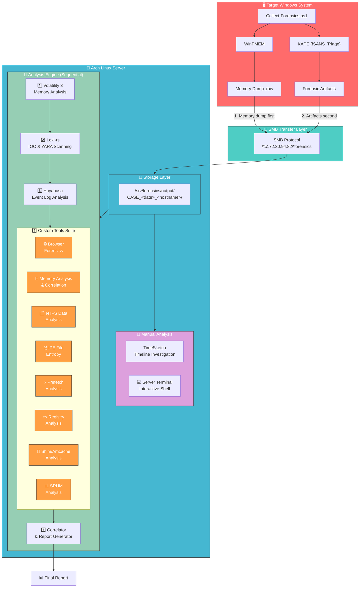
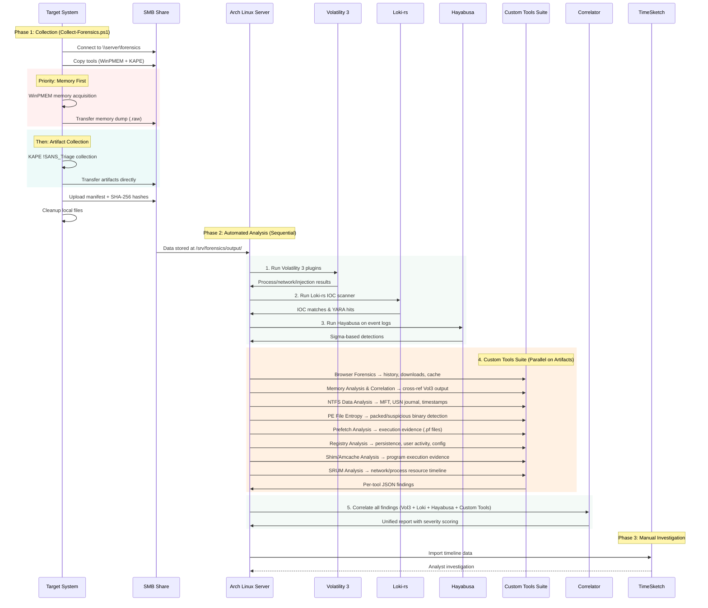
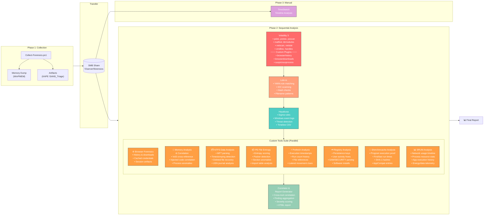
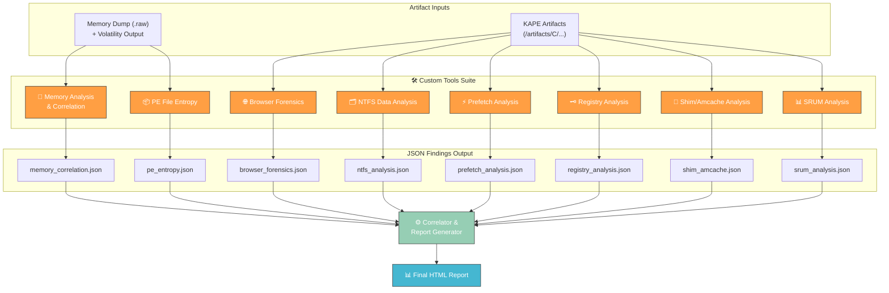
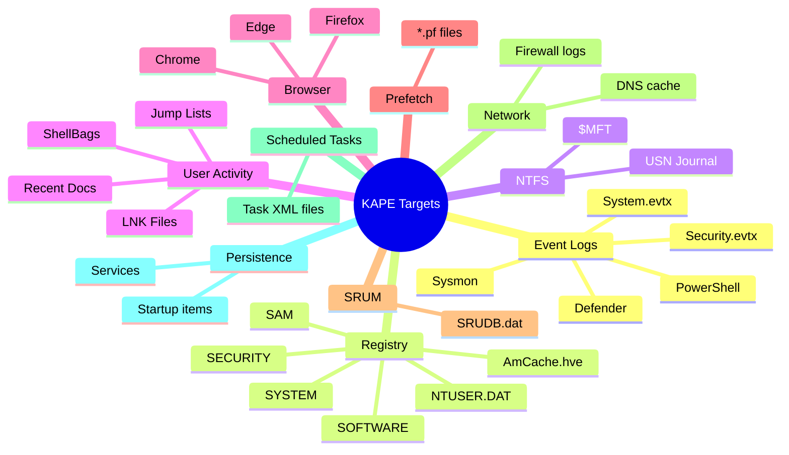
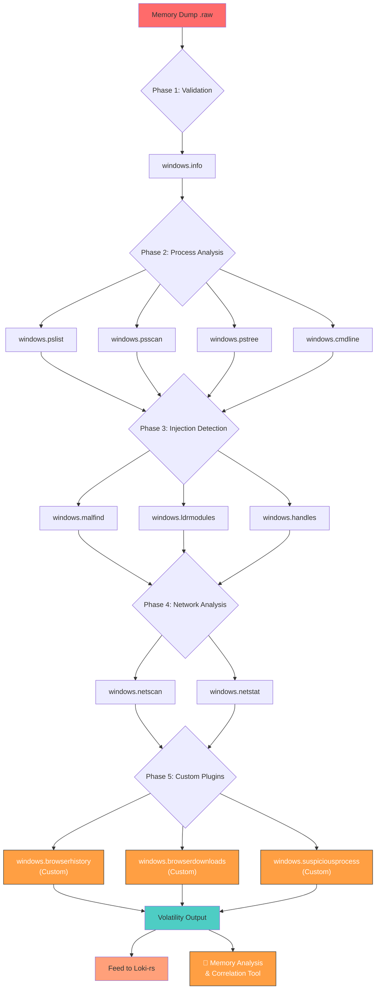
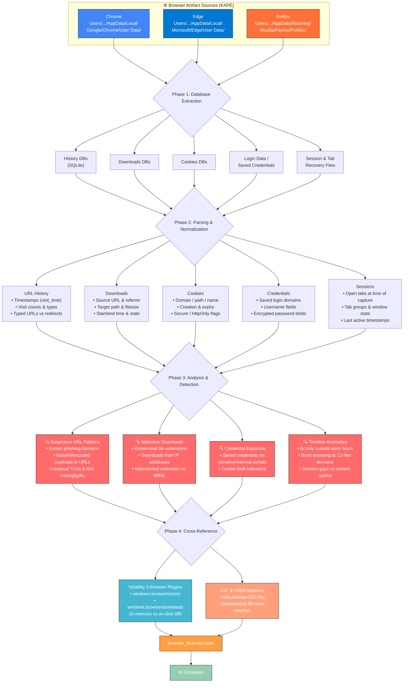

# Forensic Analysis Platform - Architecture

## System Overview



---

## Data Flow Diagram



---

## Analysis Pipeline



---

## Custom Tools Suite — Input / Output Map



---

## Artifact Collectors (KAPE !SANS_Triage)



---

## Memory Analysis Workflow (Volatility 3)



---

## Browser Forensics Workflow



---

## Server Directory Structure

```
/srv/forensics/
├── tools/                                # Tools on SMB share
│   ├── go-winpmem_amd64_signed.exe
│   └── KAPE/
│       ├── kape.exe
│       ├── Targets/
│       └── Modules/
│
├── output/                               # Case output directory
│   └── CASE_<YYYYMMDD_HHMMSS>_<HOSTNAME>/
│       ├── memory_<hostname>.raw         # Memory dump
│       ├── artifacts/                    # KAPE collected artifacts
│       │   ├── C/
│       │   │   ├── Windows/System32/winevt/Logs/
│       │   │   ├── Windows/System32/config/
│       │   │   ├── Windows/Prefetch/
│       │   │   ├── Windows/appcompat/Programs/
│       │   │   ├── Windows/System32/sru/
│       │   │   └── Users/<user>/...
│       │   └── ...
│       ├── manifest.txt                  # Collection metadata
│       ├── hashes.txt                    # SHA-256 integrity hashes
│       │
│       ├── analysis/                     # Analysis outputs
│       │   ├── volatility3/              # Vol3 plugin outputs
│       │   ├── loki-rs/                  # IOC scan results
│       │   ├── hayabusa/                 # Event log detections
│       │   └── custom-tools/             # Custom tool outputs
│       │       ├── browser_forensics.json
│       │       ├── memory_correlation.json
│       │       ├── ntfs_analysis.json
│       │       ├── pe_entropy.json
│       │       ├── prefetch_analysis.json
│       │       ├── registry_analysis.json
│       │       ├── shim_amcache.json
│       │       ├── srum_analysis.json
│       │       └── report/               # Final correlated report
│       │           └── report.html
│       │
│       └── timesketch/                   # Timeline exports
│
└── analysis-tools/                       # Server-side tools
    ├── volatility3/
    ├── loki-rs/
    ├── hayabusa/
    └── custom-tools/
        ├── browser-forensics/
        ├── memory-analysis/
        ├── ntfs-analysis/
        ├── pe-entropy/
        ├── prefetch-analysis/
        ├── registry-analysis/
        ├── shim-amcache/
        ├── srum-analysis/
        └── correlator/
```

---

## Technology Stack

| Layer | Component | Technology |
|-------|-----------|------------|
| **Collection** | Orchestration | PowerShell (Collect-Forensics.ps1) |
| **Collection** | Memory Acquisition | WinPMEM (go-winpmem) |
| **Collection** | Artifact Collection | KAPE (!SANS_Triage) |
| **Transfer** | Protocol | SMB/CIFS |
| **Server** | OS | Arch Linux |
| **Analysis 1** | Memory Analysis | Volatility 3 |
| **Analysis 2** | IOC & YARA Scanning | Loki-rs |
| **Analysis 3** | Event Log Analysis | Hayabusa (Sigma rules) |
| **Custom Tool 1** | Browser Forensics | History, Downloads, Cache, Sessions |
| **Custom Tool 2** | Memory Analysis & Correlation | Vol3 Cross-Reference & Anomaly Detection |
| **Custom Tool 3** | NTFS Data Analysis | MFT, USN Journal, Timestomping Detection |
| **Custom Tool 4** | PE File Entropy | Entropy Scoring, Packer & Section Anomalies |
| **Custom Tool 5** | Prefetch Analysis | Execution Evidence, Run Counts, File References |
| **Custom Tool 6** | Registry Analysis | Persistence, User Activity, Hive Parsing |
| **Custom Tool 7** | Shim/Amcache Analysis | Program Execution Proof, AppCompat Entries |
| **Custom Tool 8** | SRUM Analysis | Network/Process Resource Usage Timeline |
| **Analysis 5** | Correlation & Reporting | Custom Correlator (Rust) → HTML Report |
| **Manual** | Timeline Investigation | TimeSketch |
| **Manual** | Server Terminal | Web-based shell access (xterm.js + WebSocket PTY) |

---

## Execution Order

```
┌─────────────────────────────────────────────────────────────────┐
│                    TARGET SYSTEM                                │
│                                                                 │
│  1. Collect-Forensics.ps1 connects to SMB, copies tools         │
│  2. WinPMEM captures memory → transfers to server               │
│  3. KAPE collects !SANS_Triage → transfers to server            │
│  4. Manifest + hashes generated → cleanup                       │
└──────────────────────────┬──────────────────────────────────────┘
                           │ SMB
┌──────────────────────────▼──────────────────────────────────────┐
│                    ARCH LINUX SERVER                            │
│                                                                 │
│  5. Volatility 3   →  Memory analysis (pslist, malfind, etc.)   │
│  6. Loki-rs         →  IOC/YARA scanning on all artifacts       │
│  7. Hayabusa        →  Sigma-based event log detection          │
│                                                                 │
│  8. Custom Tools Suite (parallel on artifacts):                 │
│     ├── 🌐 Browser Forensics      →  browser_forensics.json     │
│     ├── 🧠 Memory Analysis & Corr →  memory_correlation.json    │
│     ├── 🗂️  NTFS Data Analysis    →  ntfs_analysis.json         │
│     ├── 📦 PE File Entropy        →  pe_entropy.json            │
│     ├── ⚡ Prefetch Analysis      →  prefetch_analysis.json     │
│     ├── 🗝️  Registry Analysis     →  registry_analysis.json     │
│     ├── 🔗 Shim/Amcache Analysis  →  shim_amcache.json          │
│     └── 📊 SRUM Analysis          →  srum_analysis.json         │
│                                                                 │
│  9. Correlator      →  Aggregate all findings → final report    │
│                                                                 │
│  ⟳ TimeSketch available for manual timeline investigation      │
│  ⟳ Server Terminal available for interactive shell access      │
└─────────────────────────────────────────────────────────────────┘
```
