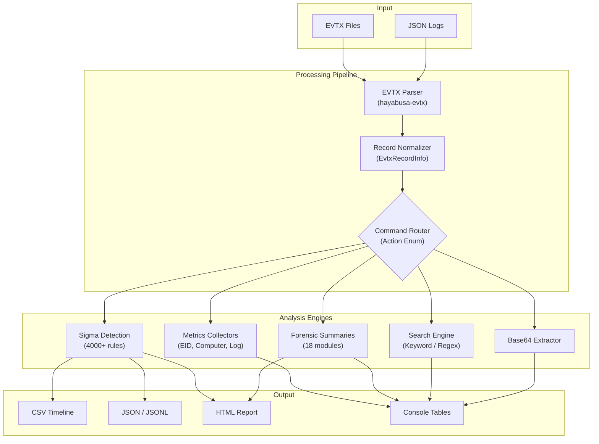

<p align="center">
  <code>
  ┏┓ ┏┳━━━┳┓  ┏┳━━━┳━━┓┏┓ ┏┳━━━┳━━━┓
  ┃┃ ┃┃┏━┓┃┗┓┏┛┃┏━┓┃┏┓┃┃┃ ┃┃┏━┓┃┏━┓┃
  ┃┗━┛┃┃ ┃┣┓┗┛┏┫┃ ┃┃┗┛┗┫┃ ┃┃┗━━┫┃ ┃┃
  ┃┏━┓┃┗━┛┃┗┓┏┛┃┗━┛┃┏━┓┃┃ ┃┣━━┓┃┗━┛┃
  ┃┃ ┃┃┏━┓┃ ┃┃ ┃┏━┓┃┗━┛┃┗━┛┃┗━┛┃┏━┓┃
  ┗┛ ┗┻┛ ┗┛ ┗┛ ┗┛ ┗┻━━━┻━━━┻━━━┻┛ ┗┛
  </code>
</p>

<h1 align="center">Forensic Analyzer — Official Documentation</h1>
<p align="center">
  <strong>v3.7.0</strong> · Rust 2024 Edition · Windows, macOS, Linux
</p>

---

## 1. Overview

Hayabusa (Forensic Analyzer) is a high-performance Windows Event Log (`.evtx`) analysis platform built in Rust. It combines Sigma-compatible rule-based detection with purpose-built forensic intelligence modules to deliver:

- **DFIR Timelines** — CSV/JSON timelines with rule-based alerts and MITRE ATT&CK mapping
- **Metrics & Triage** — Event ID distribution, logon statistics, computer inventory, log metadata
- **18 Forensic Summary Commands** — Deep-dive modules targeting specific attack surfaces (RDP, Kerberos, service abuse, privilege escalation, etc.)
- **Combined HTML Reporting** — Single-command, single-pass scan that runs all 18 forensic modules and renders a styled HTML report
- **Event Search** — Keyword and regex search across raw event data
- **Base64 Extraction** — Automatic detection and decoding of obfuscated payloads

---

## 2. Prerequisites

| Requirement | Details |
|------------|---------|
| **Rust** | v1.89.0+ (2024 edition) |
| **OS** | Windows (x86/x64), macOS (Intel/Apple Silicon), Linux |
| **Input** | `.evtx` files or JSON-formatted event logs (`.json` / `.jsonl`) |
| **Optional** | MaxMind GeoIP databases (`GeoLite2-ASN.mmdb`, `GeoLite2-City.mmdb`) |

### Building from Source

```bash
git clone <repository>
cd hayabusa-main
cargo build --release
```

The optimized binary will be at `target/release/hayabusa`.

---

## 3. Architecture



### Processing Pipeline

1. **Parse** — Binary EVTX records are deserialized via the custom `hayabusa-evtx` crate into `serde_json::Value`
2. **Normalize** — `EvtxRecordInfo` structs are built with flattened key-value maps, channel normalization, and field aliasing
3. **Route** — `Timeline::start()` dispatches each record batch to the active command's collector
4. **Detect** — For timeline commands, records pass through all loaded Sigma rules via async multi-threaded execution
5. **Emit** — Results are sorted, deduplicated, and emitted in the chosen format

---

## 4. Command Reference

### 4.1 DFIR Timeline Commands

These commands load Sigma detection rules and produce alert-based timelines.

```bash
# CSV timeline with standard profile
hayabusa csv-timeline -d ./evidence/ -o timeline.csv -p standard

# JSON timeline with MITRE ATT&CK enrichment
hayabusa json-timeline -d ./evidence/ -o timeline.jsonl -L
```

| Option | Description |
|--------|-------------|
| `-d <DIR>` | Input directory containing `.evtx` files (recursive) |
| `-f <FILE>` | Single `.evtx` file |
| `-o <FILE>` | Output file path |
| `-p <PROFILE>` | Output profile (`minimal`, `standard`, `verbose`, `all-field-info`, `super-verbose`, `timesketch-minimal`, `timesketch-verbose`) |
| `-m <LEVEL>` | Minimum alert level (`informational`, `low`, `medium`, `high`, `critical`) |
| `--exact-level <LEVEL>` | Show only alerts at this exact level |
| `-H <FILE>` | Generate HTML report alongside timeline output |
| `-L` | Enable live analysis (Windows-only: access live event logs) |
| `--enable-noisy-rules` | Include rules tagged as noisy |
| `--enable-deprecated-rules` | Include deprecated rules |
| `--low-memory` | Stream events without holding all results in memory |
| `-t <N>` | Thread count for parallel processing |
| `--timeline-start <DATE>` | Only process events after this timestamp |
| `--timeline-end <DATE>` | Only process events before this timestamp |
| `-C` | Overwrite existing output files |

---

### 4.2 Metrics & Triage Commands

Quick-triage commands that summarize event log contents without loading detection rules.

| Command | Description | Usage |
|---------|-------------|-------|
| `eid-metrics` | Event ID frequency per channel with percentage | `hayabusa eid-metrics -d ./evidence/` |
| `logon-summary` | Successful/failed logon summary by user and type | `hayabusa logon-summary -d ./evidence/` |
| `computer-metrics` | Total event count per computer name | `hayabusa computer-metrics -d ./evidence/` |
| `log-metrics` | File metadata — size, record count, time range | `hayabusa log-metrics -d ./evidence/` |
| `config-critical-systems` | Identify DCs and file servers from log patterns | `hayabusa config-critical-systems -d ./evidence/` |

---

### 4.3 Forensic Summary Commands

18 focused modules that filter events by specific Channel + Event ID combinations and present aggregated findings. Each command targets a specific forensic investigation surface.

#### System & Service Activity

| Command | Event IDs | Channel | What It Reveals |
|---------|-----------|---------|-----------------|
| `service-summary` | 7045, 7040, 7036, 7034 | System | Service installations, config changes, state changes, and crashes — detects persistence via services |
| `driver-summary` | 7045 (kernel type) | System | Kernel driver loads — identifies rootkit installation or BYOVD attacks |
| `crash-summary` | 1000, 1001 | Application | Faulting processes, exception codes, modules — reveals exploitation attempts |
| `software-install-summary` | 11707, 11724, 11728, 7045 | Application, System | MSI installs/removals and service installations |
| `windows-update-summary` | 19, 20, 43 | System | Patch status — identifies unpatched systems |

#### Account & Privilege Activity

| Command | Event IDs | Channel | What It Reveals |
|---------|-----------|---------|-----------------|
| `account-changes` | 4720-4726, 4738, 4781 | Security | Full account lifecycle — backdoor account creation, unauthorized modifications |
| `group-changes` | 4728-4733, 4756-4757 | Security | Group membership modifications — privilege escalation via group manipulation |
| `password-changes` | 4723, 4724 | Security | Self-changes vs admin resets — credential compromise indicators |
| `privilege-use-summary` | 4673, 4674 | Security | Sensitive privilege invocations — identifies SeDebugPrivilege, SeTakeOwnership abuse |

#### Authentication Deep Dives

| Command | Event IDs | Channel | What It Reveals |
|---------|-----------|---------|-----------------|
| `rdp-summary` | 4624(LT10), 1149, 21-25 | Security, TS-LSM, TS-RCM | Complete RDP session lifecycle — lateral movement tracking |
| `kerberos-summary` | 4768-4771 | Security | TGT/TGS requests, renewals, pre-auth failures — Kerberoasting, Golden/Silver ticket detection |
| `failed-logon-detail` | 4625 | Security | Failed logons with decoded SubStatus reasons — brute force, password spray identification |
| `logon-type-breakdown` | 4624 | Security | Logon type distribution — identifies unusual interactive/remote access patterns |

#### Network & Firewall Activity

| Command | Event IDs | Channel | What It Reveals |
|---------|-----------|---------|-----------------|
| `firewall-summary` | 5156-5159 | Security | WFP allowed/blocked connections — C2 communication, lateral movement |
| `share-access-summary` | 5140, 5145 | Security | Network share access by user and source — data staging and exfiltration |

#### Audit & Policy Activity

| Command | Event IDs | Channel | What It Reveals |
|---------|-----------|---------|-----------------|
| `audit-policy-changes` | 4719, 4817 | Security | Audit policy modifications — defense evasion via audit tampering |
| `log-cleared` | 1102, 104 | Security, System | Log clearing events — anti-forensic activity |
| `object-access-summary` | 4656, 4663, 4660 | Security | File and object access/deletion — data destruction or exfiltration |

**Common options for all forensic summary commands:**

```bash
hayabusa <command> -d <DIR> [-f <FILE>] [-o <FILE>.csv] [-C] \
         [--timeline-start <DATE>] [--timeline-end <DATE>] [-t <N>]
```

---

### 4.4 Combined Forensic Report

The `forensic-report` command runs **all 18 forensic summary modules in a single pass** and generates a styled HTML report.

```bash
# Generate combined HTML report
hayabusa forensic-report -d ./evidence/ -o forensic_report.html

# With time filtering
hayabusa forensic-report -d ./evidence/ -o report.html \
         --timeline-start "2024-01-01 00:00:00" \
         --timeline-end "2024-03-01 23:59:59"
```

The report includes:
- **Header** with scan metadata (input path, timestamp, records scanned, total findings)
- **Stats bar** with per-category counts
- **6 collapsible sections** organized by forensic domain
- **Sortable tables** for each command's results
- **Search** across all findings
- **Category filter** buttons

> [!TIP]
> The single-pass architecture means EVTX files are read once regardless of how many forensic modules are active. This is significantly faster than running 18 commands separately.

---

### 4.5 Search & Extraction Commands

| Command | Description | Usage |
|---------|-------------|-------|
| `search` | Keyword or regex search across all events | `hayabusa search -d ./evidence/ -k "mimikatz,cobalt"` |
| `extract-base64` | Detect and decode base64-encoded strings | `hayabusa extract-base64 -d ./evidence/ -o decoded.csv` |
| `pivot-keywords-list` | Extract usernames, IPs, hostnames for pivoting | `hayabusa pivot-keywords-list -d ./evidence/` |
| `expand-list` | Expand placeholder variables from rule files | `hayabusa expand-list -d ./rules/` |

**Search options:**

| Option | Description |
|--------|-------------|
| `-k <KEYWORDS>` | Comma-separated keywords (AND logic between keywords) |
| `-e <REGEX>` | Regular expression pattern |
| `--and-logic` / `--or-logic` | Logic between multiple keywords |

---

### 4.6 Configuration & Management Commands

| Command | Description | Usage |
|---------|-------------|-------|
| `update-rules` | Fetch latest rules from GitHub | `hayabusa update-rules` |
| `level-tuning` | Adjust alert severity levels | `hayabusa level-tuning -f tuning.yml` |
| `set-default-profile` | Set default output profile | `hayabusa set-default-profile` |
| `list-profiles` | Show available output profiles | `hayabusa list-profiles` |
| `list-contributors` | Print contributor list | `hayabusa list-contributors` |

---

## 5. Detection Engine

### Sigma Compatibility

The detection engine implements the [Sigma](https://sigmahq.io/) specification for detection rules:

| Feature | Support |
|---------|---------|
| Keywords | Single, lists, with `all` modifier |
| Selections | AND/OR combinations of field-value pairs |
| Conditions | Boolean expressions combining selections |
| Aggregation | `count`, `min`, `max`, `avg`, `sum`, `value_count`, `near` |
| Correlation | Temporal and ordered-temporal multi-rule correlation |
| Timeframes | Sliding window for event correlation |

### Field Modifiers

| Modifier | Description |
|----------|-------------|
| `contains` | Substring match |
| `startswith` / `endswith` | Prefix/suffix match |
| `re` | Regular expression |
| `cidr` | CIDR network range match |
| `base64` / `base64offset` | Base64-encoded value matching |
| `all` | All values in a list must match |
| `windash` | Match both `/` and `-` argument syntax |
| `expand` | Expand environment variable placeholders |

### Field Data Mapping

Numeric fields are automatically translated to human-readable values using configurable YAML maps. For example:

| Field | Raw Value | Mapped Value |
|-------|-----------|-------------|
| LogonType | `2` | `Interactive` |
| LogonType | `3` | `Network` |
| LogonType | `10` | `RemoteInteractive` |

---

## 6. Rule System

### Directory Structure

```
rules/
├── config/               # Configuration files
│   ├── channel_abbreviations.txt
│   ├── provider_abbreviations.txt
│   ├── eventkey_alias.txt
│   ├── target_event_IDs.txt
│   ├── geoip/            # GeoIP field mappings
│   └── default_profile.yaml
├── hayabusa/             # Hayabusa-native rules
│   ├── builtin/          # Windows built-in log rules
│   └── sysmon/           # Sysmon-based rules
└── sigma/                # Standard Sigma community rules
```

### Rule Filtering

| Flag | Description | Example |
|------|-------------|---------|
| `-m <LEVEL>` | Minimum severity level | `-m high` |
| `--exact-level <LEVEL>` | Exact severity level | `--exact-level critical` |
| `--include-tag <TAG>` | Include only rules matching tag | `--include-tag attack.lateral_movement` |
| `--exclude-tag <TAG>` | Exclude rules matching tag | `--exclude-tag sysmon` |
| `--include-eid <EID>` | Include only specific Event IDs | `--include-eid 4624,4625` |
| `--exclude-eid <EID>` | Exclude specific Event IDs | `--exclude-eid 10` |
| `--include-status <STATUS>` | Filter by rule status | `--include-status stable` |
| `--enable-noisy-rules` | Include noisy rules | |
| `--enable-deprecated-rules` | Include deprecated rules | |

---

## 7. Output Profiles

Profiles control which columns appear in timeline output. Set with `-p <PROFILE>`:

| Profile | Description |
|---------|-------------|
| `minimal` | Timestamp, Computer, Channel, EventID, Level, RuleTitle |
| `standard` | Adds RuleFile, MitreTactics, MitreTags |
| `verbose` | Adds RecordID, Provider, Details, ExtraFieldInfo |
| `all-field-info` | All fields including RuleAuthor, creation/modified dates, Status |
| `all-field-info-verbose` | Maximum detail with RenderedMessage |
| `super-verbose` | Everything including recovered record flag |
| `timesketch-minimal` | Timesketch-compatible minimal output |
| `timesketch-verbose` | Timesketch-compatible verbose output |

---

## 8. GeoIP Enrichment

When MaxMind GeoIP databases are placed in the working directory, Hayabusa automatically enriches events containing IP addresses:

| Enriched Field | Source |
|----------------|--------|
| `SrcASN`, `SrcCountry`, `SrcCity` | Source IP addresses |
| `TgtASN`, `TgtCountry`, `TgtCity` | Target/destination IP addresses |

Configured via `rules/config/geoip/` YAML files that map Channel + Event ID to IP field aliases.

---

## 9. Filtering

### Global Filters (apply to all commands)

| Filter | Flags | Description |
|--------|-------|-------------|
| **Time Window** | `--timeline-start`, `--timeline-end` | Restrict analysis to a time range. Format: `"2024-01-01 00:00:00 +09:00"` |
| **Computer** | `--include-computer`, `--exclude-computer` | Limit to specific computer names |
| **Event ID** | `--include-eid`, `--exclude-eid` | Restrict to specific Event IDs |
| **Checksum** | `-V`, `--validate-checksums` | Validate EVTX file integrity before processing |
| **File Extension** | `--evtx-file-ext` | Add additional file extensions beyond `.evtx` |
| **JSON Input** | `-J` | Parse JSON-formatted logs instead of EVTX |

### Timeline-Specific Filters

| Filter | Flags | Description |
|--------|-------|-------------|
| **Severity** | `-m <LEVEL>`, `--exact-level <LEVEL>` | Minimum or exact alert level |
| **Rule Tags** | `--include-tag`, `--exclude-tag` | MITRE ATT&CK technique tags |
| **Rule Status** | `--include-status`, `--exclude-status` | Sigma rule maturity status |
| **EID Filter** | `--eid-filter` | Apply EID-based channel filtering |

---

## 10. Performance

| Feature | Description |
|---------|-------------|
| **Multi-threading** | Configurable via `-t <N>`. Defaults to available CPU cores. |
| **Low Memory Mode** | `--low-memory` streams results without accumulating in memory |
| **mimalloc Allocator** | Custom memory allocator for faster allocation patterns |
| **Aho-Corasick** | Multi-pattern string matching for abbreviation replacement |
| **Async Rule Execution** | Tokio-based concurrent rule evaluation per record batch |
| **Progress Bar** | Visual scan progress when outputting to file |
| **Record Recovery** | `--enable-recover-records` processes carved/recovered EVTX records |

---

## 11. Investigative Workflows

### Initial Triage

```bash
# 1. What logs do we have?
hayabusa log-metrics -d ./evidence/

# 2. Which systems generated events?
hayabusa computer-metrics -d ./evidence/

# 3. What Event ID distribution exists?
hayabusa eid-metrics -d ./evidence/ -o eid-breakdown.csv
```

### Lateral Movement Investigation

```bash
# RDP session lifecycle
hayabusa rdp-summary -d ./evidence/ -o rdp-sessions.csv

# Failed logon patterns (brute force / password spray)
hayabusa failed-logon-detail -d ./evidence/ -o failed-logons.csv

# Logon type analysis (look for Network, RemoteInteractive)
hayabusa logon-type-breakdown -d ./evidence/

# Network share access (data staging)
hayabusa share-access-summary -d ./evidence/ -o shares.csv
```

### Persistence & Privilege Escalation

```bash
# Service installations (persistence)
hayabusa service-summary -d ./evidence/ -o services.csv

# Kernel driver installations (BYOVD / rootkit)
hayabusa driver-summary -d ./evidence/

# Account manipulation
hayabusa account-changes -d ./evidence/ -o accounts.csv

# Group membership changes
hayabusa group-changes -d ./evidence/ -o groups.csv

# Privilege abuse
hayabusa privilege-use-summary -d ./evidence/
```

### Defense Evasion Detection

```bash
# Log clearing (anti-forensics)
hayabusa log-cleared -d ./evidence/

# Audit policy changes
hayabusa audit-policy-changes -d ./evidence/
```

### Full Forensic Report

```bash
# Run all 18 modules in one pass and get an HTML report
hayabusa forensic-report -d ./evidence/ -o full_report.html
```

---

## 12. MITRE ATT&CK Coverage

The forensic summary commands map to the following ATT&CK techniques:

| Module | Primary Techniques |
|--------|-------------------|
| `service-summary` | T1543.003 (Create/Modify System Process: Service) |
| `driver-summary` | T1014 (Rootkit), T1068 (BYOVD) |
| `account-changes` | T1136 (Create Account), T1098 (Account Manipulation) |
| `group-changes` | T1098.007 (Additional Cloud Roles) |
| `privilege-use-summary` | T1134 (Access Token Manipulation) |
| `rdp-summary` | T1021.001 (Remote Desktop Protocol) |
| `kerberos-summary` | T1558 (Kerberoasting), T1550.003 (Pass the Ticket) |
| `failed-logon-detail` | T1110 (Brute Force) |
| `share-access-summary` | T1021.002 (SMB/Windows Admin Shares) |
| `firewall-summary` | T1071 (Application Layer Protocol) |
| `log-cleared` | T1070.001 (Indicator Removal: Clear Windows Event Logs) |
| `audit-policy-changes` | T1562.002 (Impair Defenses: Disable Windows Event Logging) |
| `software-install-summary` | T1072 (Software Deployment Tools) |
| `object-access-summary` | T1565 (Data Manipulation) |

---

## 13. Technology Stack

| Component | Crate | Purpose |
|-----------|-------|---------|
| **EVTX Parser** | `evtx` (custom fork) | Binary event log deserialization with fast allocation |
| **CLI Framework** | `clap` | Derive-based argument parsing with subcommands |
| **JSON Engine** | `serde_json` | Event record serialization/deserialization |
| **Async Runtime** | `tokio` | Parallel rule execution and file processing |
| **Timestamps** | `chrono` | Date/time parsing, formatting, timezone handling |
| **GeoIP** | `maxminddb` | MaxMind database lookups for IP enrichment |
| **Git Operations** | `git2` | Rule repository update via `libgit2` |
| **Table Rendering** | `comfy-table` | Formatted console table output |
| **YAML Parsing** | `yaml-rust2` | Sigma rule and configuration file parsing |
| **Pattern Matching** | `aho-corasick`, `regex` | Multi-pattern and regex string matching |
| **Progress Display** | `indicatif` | Visual progress bars during analysis |
| **CSV I/O** | `csv` | CSV reading and writing |
| **HTML Reports** | `horrorshow` | HTML template rendering |
| **Memory** | `mimalloc`, `compact_str`, `hashbrown` | Optimized allocation, strings, and hash maps |
| **Encoding** | `encoding_rs` | Character encoding detection and conversion |
| **Networking** | `ureq` | HTTP client for rule updates |

---

## 14. File Structure

```
hayabusa/
├── src/
│   ├── main.rs                          # Entry point, CLI dispatch
│   ├── afterfact.rs                     # Post-processing, CSV/JSON emission
│   ├── detections/
│   │   ├── configs.rs                   # CLI definitions, StoredStatic
│   │   ├── detection.rs                 # Sigma rule matching engine
│   │   ├── rule/                        # Rule parser and aggregation
│   │   ├── message.rs                   # Alert message formatting
│   │   └── field_data_map.rs            # Field value translation
│   ├── timeline/
│   │   ├── timelines.rs                 # Orchestration and display
│   │   ├── metrics.rs                   # EID, logon, log metrics
│   │   ├── forensic_metrics.rs          # 18 forensic collection functions
│   │   ├── forensic_report.rs           # Combined HTML report renderer
│   │   ├── search.rs                    # Event search engine
│   │   ├── computer_metrics.rs          # Computer name metrics
│   │   ├── extract_base64.rs            # Base64 extraction
│   │   ├── config_critical_systems.rs   # DC/file server detection
│   │   └── log_metrics.rs              # Log file metadata
│   ├── options/
│   │   ├── htmlreport.rs                # HTML report generation
│   │   ├── geoip_search.rs              # GeoIP enrichment
│   │   ├── profile.rs                   # Output profile management
│   │   ├── pivot.rs                     # Pivot keyword extraction
│   │   ├── level_tuning.rs              # Alert level adjustment
│   │   └── update.rs                    # Rule update via Git
│   └── artifacts/                       # MFT, behavioral, correlation
├── rules/                               # Detection rules (Sigma + Hayabusa)
├── config/                              # Runtime configuration
└── doc/                                 # Documentation
```

---

<p align="center">
  <sub>Built by <strong>KaliHeker</strong> · Powered by Rust</sub>
</p>
