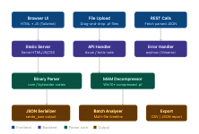

A Windows Prefetch File Viewer in Rust is an excellent forensics tool. Let me break down how it should be designed — architecture, parsing logic, and UI — then show you the full structure visually.

## What it does

Windows stores `.pf` files in `C:\Windows\Prefetch\` to speed up application launches. From a forensic standpoint, these files are gold — they reveal **what ran, when, how many times, and what files/DLLs it touched.** Your tool parses this binary format and presents it in a clean web UI.

## Core architecture

The tool has three layers: a **binary parser**, a **REST backend** (using Actix-web or Axum), and a **frontend** served as static files. The frontend makes API calls to display parsed data.



## What to parse from the binary

The `.pf` format has changed across Windows versions. You need to handle formats **17** (XP), **23** (Vista/7), **26** (Win8), and **30** (Win10+, MAM-compressed).

Key fields to extract and display:

**Header section** — executable name (up to 29 UTF-16 chars), prefetch hash (4 bytes), format version, file size, last run time(s) (up to 8 timestamps in Win8+), and run count.

**File metrics array** — every file that was loaded during the application's first ~10 seconds of execution. Each entry has a filename offset, filename length, and file reference (NTFS MFT number + sequence). This is forensically critical — it shows DLLs, configs, temp files, and side-loaded libraries.

**Trace chains** — the sequence of memory/disk access blocks. Less commonly displayed but useful for deep analysis.

**Volume information** — device path (e.g. `\DEVICE\HARDDISKVOLUME3`), volume creation time, volume serial number, and the directory strings referenced from that volume.

**String table** — all file paths referenced, stored as a flat UTF-16 blob with null separators.

## What the Web UI should show

The UI should have four main views:

**1. File list panel (left sidebar)** — all uploaded `.pf` files listed with their executable name, run count, and last run time. Clicking one loads its detail view.

**2. Overview tab** — a summary card showing executable name, full prefetch hash, format version, last run timestamps (formatted in local + UTC), run count, and volume info.

**3. File references tab** — a searchable, sortable table of every file loaded. Columns: index, filename, file reference (MFT number), and flags. This is the most forensically useful view — you can spot DLL hijacks, temp file usage, and staging directories here.

**4. Timeline tab** — when multiple `.pf` files are loaded, plot all last-run timestamps on a horizontal timeline so you can see execution order during an incident.

## Rust crate recommendations

```
axum          → HTTP server + routing
tower-http    → static file serving
serde / serde_json → JSON serialization
nom or byteorder  → binary parsing
chrono        → timestamp formatting (FILETIME → Unix)
lz-fear or xpress-decode → MAM/LZXPRESS decompression (Win10+)
tokio         → async runtime
anyhow        → error handling
```

## Key implementation notes for forensic accuracy

**FILETIME conversion** — Windows timestamps are 100-nanosecond intervals since January 1, 1601. Convert to Unix: `(filetime - 116444736000000000) / 10000000`. Always display both UTC and local.

**MAM decompression** — Win10+ files start with a 4-byte signature (`MAM\x04`) followed by the uncompressed size, then LZXPRESS Huffman-compressed data. You must decompress before parsing the prefetch header.

**Hash verification** — the prefetch hash in the filename (e.g. `NOTEPAD.EXE-ABCD1234.pf`) should match the hash stored in the header. If they differ, flag it — it can indicate tampering.

**Multiple run timestamps** — Win8+ stores up to 8 last-run times in descending order. Display all of them, not just the most recent.

**Path reconstruction** — file references combine a volume device path with entries from the string table. Your UI should reconstruct and display full paths like `\Device\HarddiskVolume3\Windows\System32\ntdll.dll`.

This gives you a solid forensic tool that goes well beyond a simple hex dump — it surfaces the data in a way that's actually useful during incident response or malware analysis.